# E-Learning Website

This project implements an e-learning system using Laravel, React and MongoDB with the following features:
* Admins shall be able to add instructors, students and courses
* Admins shall be able to assign instructors to courses
* Instructors shall be able to add students
* Instructors shall be able to create assignments
* Instructors shall be able to create announcements
* Students shall be able to view and submit assignments
* Students shall be able to view their enrolled courses

# Screenshots of the pages

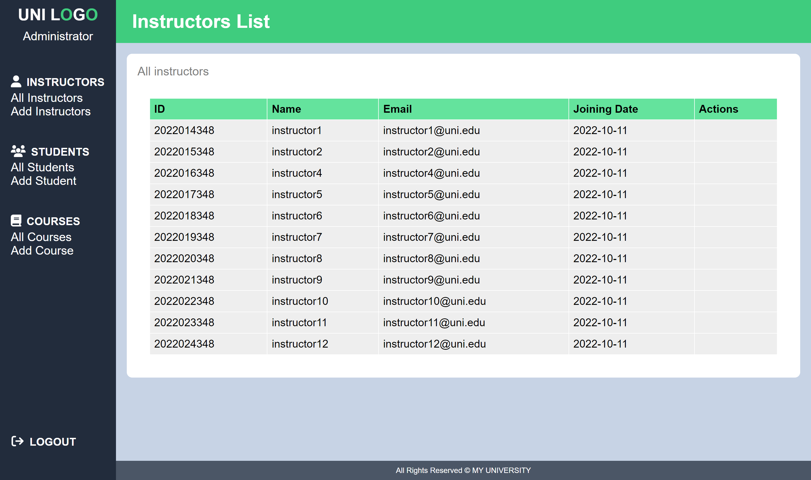
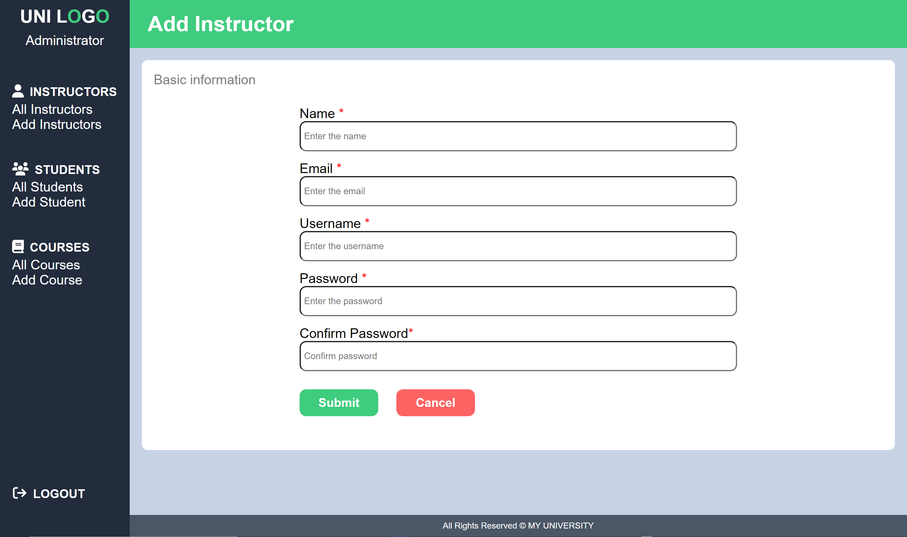
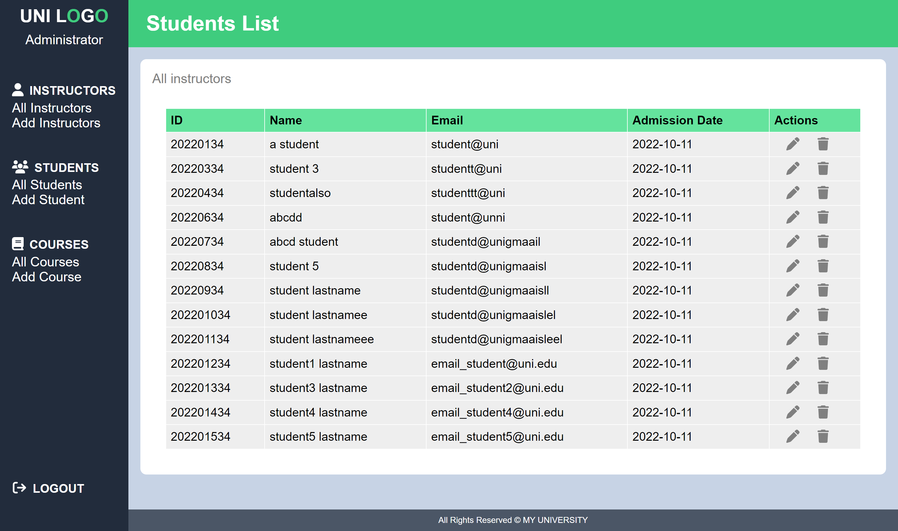
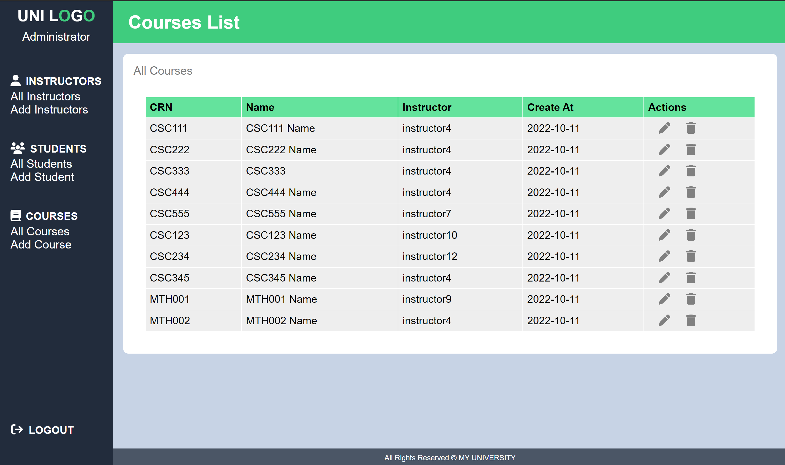
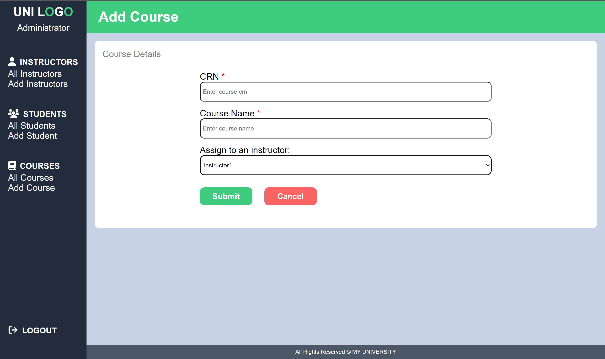
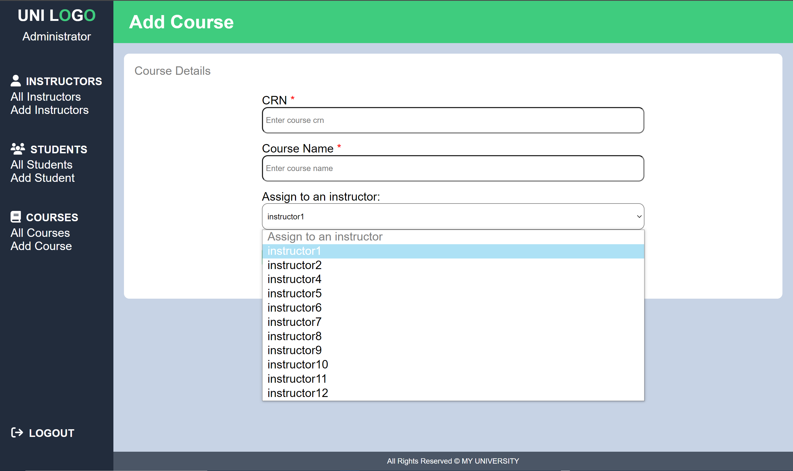
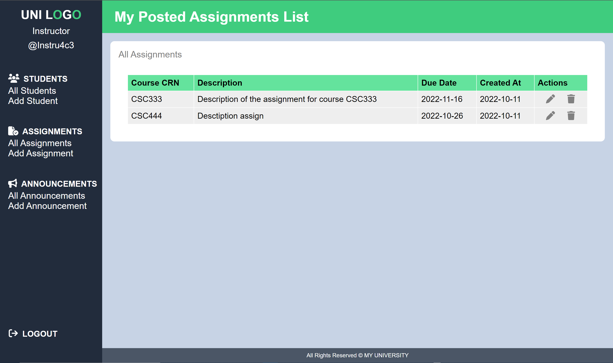
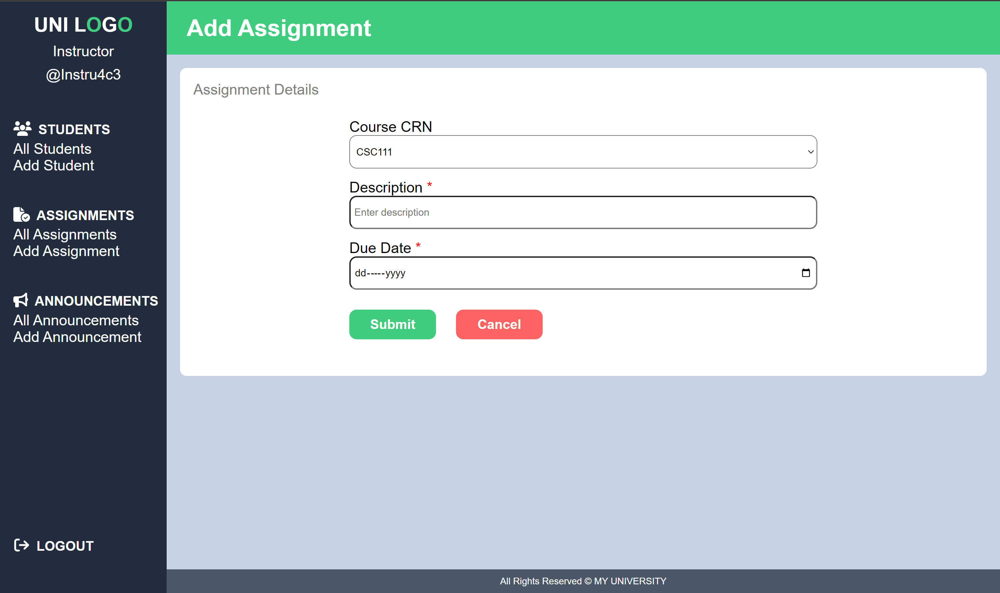
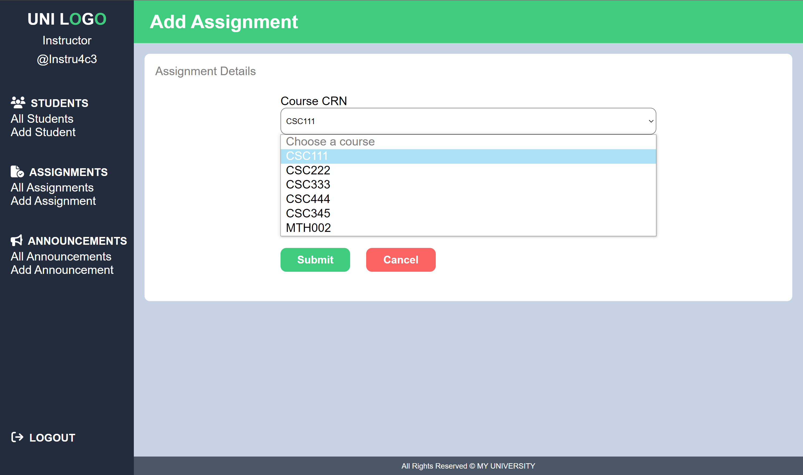
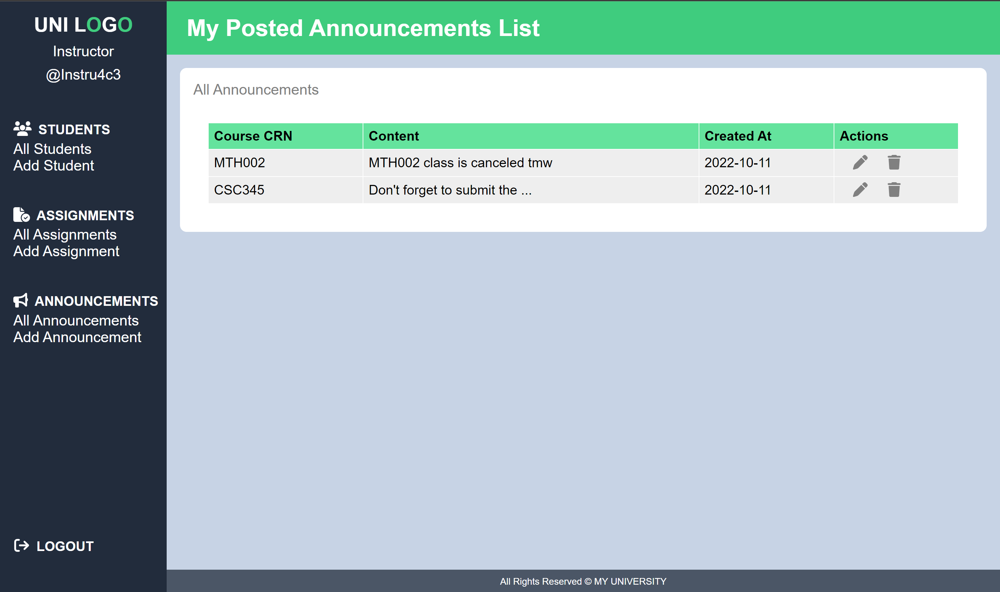
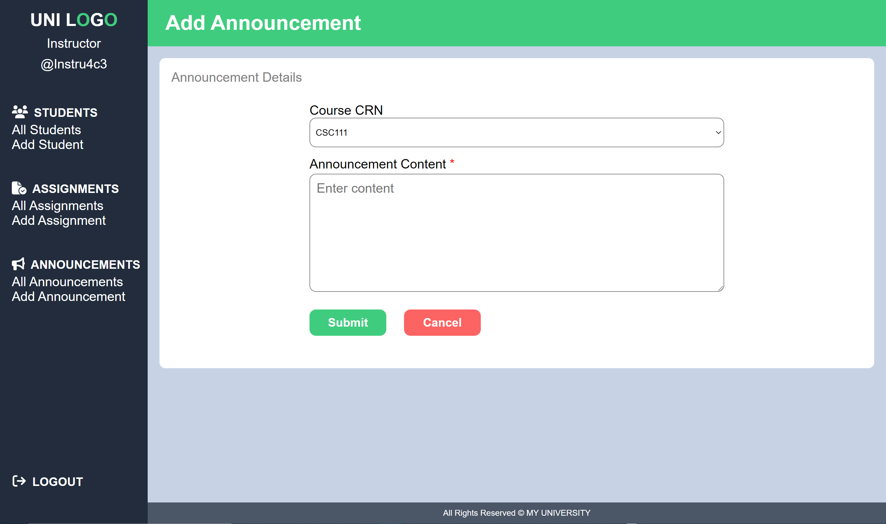

